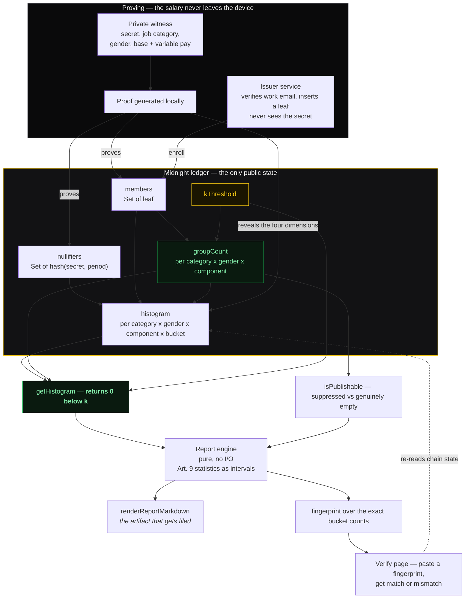

# GotIt — Provable Pay Gap Reports

> **For European companies that must publish gender pay gap statistics by 7 June 2027, and cannot do it without exposing their employees.**

GotIt turns a company's payroll data into a **legally defensible pay gap report** — one that
proves where the numbers came from, and never exposes a single employee. Built on **Midnight
Network (Compact)**, where the salary is a private witness and only counts ever reach the
ledger.

> **Renamed from *Candor* for Wave 2.** A second Wave 1 project was also called "Candor"
> (a proof-of-reserves product), so neither was findable. Where the old name survives, and why:
>
> | Where | Why it stays |
> |---|---|
> | Git history | Rewriting it would break every commit hash for no benefit |
> | `candor:*` hash domain strings | Inputs to the deployed contract `e7cf6ffc…dd53d`. Changing them would make TS-derived values disagree with on-chain state, rejecting every prior member as "not a member". Moves to `gotit:*` only on redeploy, under a version bump. |
> | `candor.compact`, `managed/candor/`, `/zk/candor` | Compiled artefact paths and the contract source name — must keep matching the deployed contract |
> | `candor-midnight-*.fly.dev` | Renaming a Fly app destroys its hostname and URL history |
> | `gotit:*` localStorage keys | Renamed, with a transparent fallback that reads the `candor:*` key — so a returning visitor keeps their secret, which matters because it derives the on-chain nullifier |

## The problem

Starting 7 June 2027, every EU company with 150+ employees must publish gender pay gap
statistics under Directive (EU) 2023/970: mean and median gap, base salary versus variable
pay, and the distribution of men and women across each pay quartile. A gap of 5% or more that
cannot be objectively justified triggers a joint pay assessment with worker representatives —
and the burden of proof shifts to the employer.

That creates a trap. To file, you must publish group statistics. To comply with data
protection law, you must never let those statistics identify anyone. Companies resolve it with
a spreadsheet and a person who remembers to delete the rows with three people in them.

| Approach | Proves the data is real? | Protects individuals? |
|---|---|---|
| Payroll spreadsheet | No — anyone can edit it | No — it *is* the raw records |
| Internal HR survey | No — self-reported, gameable | No — participation is voluntary and uneven |
| "Anonymised" CSV export | No | No — small cells re-identify |
| Employer attestation | It's a promise | Depends entirely on trust |
| **GotIt** | **Yes — cryptographically** | **Yes — enforced on-chain** |

The buyer is specific and named: the Head of Total Rewards at a 150–2,500 person European
company, whose project starts now because they must report on last year.

## How it works

1. **Employees commit privately.** Each person enters job category, gender, base pay and
   variable pay into a form that runs on their own device. The details never leave it.
2. **The counting happens where nobody can see it.** A count per (job category, gender) rises
   on-chain, computed by each employee's own proof. Only the count is ever public.
3. **Small groups cannot be published, even by the employer.** If either side of a comparison
   falls below the anonymity threshold, the row is withheld. This is enforced in the circuit,
   not by policy — publishing one side of a comparison reveals the other by subtraction.
4. **The employer ships proof, not assertions.** A report anyone can verify against chain
   state, including that the data came from real employees and that nobody was counted twice.

## Product in one sentence

*Publish a pay gap report. Never expose one employee.*

## Architecture

The one thing to understand: **the salary is a private witness, and only counts are ever
public.** Everything else follows from that.



Two properties in that diagram are load-bearing:

1. **The issuer can verify membership but cannot link a submission to a person.** It receives
   a *leaf* — `hash(secret)` — and never the secret that generates the nullifier, so it cannot
   derive anyone's nullifier, let alone match it to a cell.
2. **Suppression lives in the read circuit, not in the UI.** `getHistogram` returns 0 for any
   group below `kThreshold`, so a category with three people in it cannot be published — not
   by an employer override, not by a bespoke reader, not by accident. `groupCount` is per
   `(category, gender, component)`, so a large group in one category can never make a group of
   one in another publishable.

**Packages**

| Package | Role | Tests |
|---|---|---|
| `packages/contract` | Compact source → generated TS → proving keys; two ledgers (v1 deployed, v2 Wave 2) | 34 |
| `packages/shared` | Hash parity with the circuits, bucket scales, the Art. 9 report engine | 38 |
| `packages/issuer` | Work-email verification → leaf insertion (the only trusted component) | — |
| `apps/web` | Report page, verification page, contribute wizard, Operator console | 31 |

**Ledger (v2 — the Wave 2 contract)**

| Field | Purpose |
|---|---|
| `members: Set<Bytes<32>>` | leaf = `persistentHash(["gotit:member:v2", secret])`, insertion issuer-gated |
| `nullifiers: Set<Bytes<32>>` | **period-scoped**: `persistentHash(["gotit:nf:v2", period, secret])` |
| `histogram: Map<Bytes<32>, Uint<64>>` | key = `persistentHash([categoryKey, gender, component, bucket])` |
| `groupCount: Map<Bytes<32>, Uint<64>>` | key = `persistentHash([categoryKey, gender, component])` — the k-gate input |
| `kThreshold: Uint<8>` | anonymity threshold, fixed at deployment (`readK()` is public) |
| `epochCount: Map<Bytes<1>, Uint<64>>` | readable period cell; `Counter` is not readable inside 0.23 circuits |
| `issuer: Bytes<32>` | public commitment to the issuer's secret key |

Seven circuits: `submit`, `enroll`, `nextEpoch`, `getHistogram`, `isPublishable`, `readEpoch`,
`readK`.

> **Wave 1's contract is untouched.** It stays deployed at `e7cf6ffc…dd53d` with its
> `candor:*:v1` domain strings, which are inputs to its hash derivations. v2 is a separate
> contract with `gotit:*:v2` strings — a v1 leaf deliberately does not validate against v2,
> which is what the version bump is for. Both hash versions live in
> `packages/shared/src/hash.ts`, side by side, each annotated with why it is frozen.

**Report engine (`packages/shared/src/paygap.ts`)**

Pure functions, no I/O, so a third party can re-run them against on-chain state and get
byte-identical output — which is what makes the report verifiable rather than merely
generated. Outputs map to Art. 9(1): mean gap, gap in variable components, median gap,
median gap in variable components, proportion receiving variable pay, plus quartile
distribution.

Two accuracy decisions worth stating plainly:

- **Means and gaps are reported as intervals, not point estimates.** Bucketed data only
  bounds the true value. Quartiles and counts are exact.
- **The 5% materiality flag uses the bound nearest zero, not the midpoint.** A range of
  [−33%, +50%] has midpoint +8.3%, but the sign is not even provable. Flagging it would
  trigger a joint pay assessment on a category that may be perfectly compliant, so only a
  *proven* disparity of the required size counts.

## Trust boundary

**Proof generation must be user-local.** The witness *is* the salary, so hosted proving is
permanently rejected as a privacy guarantee. The hosted demo routes proving through a
server and says so in the UI; the real guarantee requires `pnpm dev:all`.

Wave 1 uses a **trusted issuer** that learns *who is a member* but cannot link a *submission*
to a member — it never sees the secret that derives the nullifier. Removing it entirely
(Merkle membership) is Wave 3.

## Deployed

- **App:** https://candor-midnight-web.fly.dev
- **Issuer:** https://candor-midnight-issuer.fly.dev/health
- **Report:** https://candor-midnight-web.fly.dev/#report
- **Verify a report:** https://candor-midnight-web.fly.dev/#verify
- **Report format, with illustrative data:** https://candor-midnight-web.fly.dev/#report&sample

> The report page reads the **v2** ledger, which is not deployed yet, so `#report` currently
> states that there is nothing publishable rather than showing numbers. `#report&sample` shows
> the same page with clearly-labelled illustrative data. See [docs/DEPLOY.md](docs/DEPLOY.md) §5.
- **Contract (Wave 1):** `e7cf6ffc48ebeb450813104e6a5ab3d585f7e275bcd32e5ea82eb7a8c21dd53d`

Verified end-to-end on Preprod (deploy → enroll → submit → aggregate), with real
transactions in the contract's histogram. The three Fly apps are **running** — one machine
each. Redeploy or resume with:

```bash
set -a; source .env; set +a          # FLY_ACCESS_TOKEN
fly deploy -c fly.prover.toml        # own proof server (hosted preprod 403s)
fly deploy -c fly.issuer.toml
fly deploy -c fly.web.toml           # last: Caddy serves the app + same-origin proxies
```

> **Live reads now use the official indexer.** The previous upstream
> (`blockfrost.lw.iog.io/midnight-preprod`) now returns `410 Gone` — "Midnight endpoints have
> been removed from this proxy". We moved to `indexer.preprod.midnight.network` API v4, still
> through our own origin so an indexer change needs no rebuild. Verified: the app reads epoch 1
> and 2 real submissions straight off the deployed contract.

> The Fly app names still say `candor-*` because renaming an app destroys its URL history.
> They are infrastructure, not brand.

Deploy your own instance: `fly deploy -c fly.issuer.toml` then `fly deploy -c fly.web.toml`
(see `deploy/` for Dockerfiles and the Caddyfile).

## Project status (honest)

| Piece | State |
|---|---|
| Compact contract v1 (0.31.1 / lang 0.23) | **Live on Preprod** — 5 circuits `submit`, `enroll`, `nextEpoch`, `getHistogram`, `readEpoch`. Frozen: its `candor:*` hash domains are inputs to a live deployment, so they cannot change. |
| Off-chain circuit tests | **45 passing** against the generated contract, across both ledgers. 13 cover v1 (happy path, double-submit, non-member, bad bucket, histogram-not-sum leak); 21 cover v2, six of which exist only to hold the anonymity gate down. 11 more run the whole chain-to-report path through the generated contract |
| Report engine (`paygap.ts`) | **38 tests passing** — Art. 9 statistics, interval arithmetic, two-sided suppression |
| Report + verification pages | **Live** — reads real chain state, publishes a fingerprint, a third party can verify with no wallet. Deep-linkable at `#report` and `#verify`. |
| v2 ledger (Art. 9 dimensions) | **Compiled + 34 circuit tests** — category × gender × base/variable, with the anonymity gate enforced in the read circuit. **Not yet deployed**; the Operator console can deploy it. |
| Issuer service | **Works** — codes in-band, `POST /enroll` idempotent; email infra mock in Wave 1 |
| Browser chain path (Lace + Midnight.js 4.1.1) | **End-to-end verified on Preprod** with real transactions |
| Compliance report UI | **Live** — Art. 9 tables, interval means, two-sided suppression, coverage disclosure, and an in-circuit k-gate. Reads the v2 ledger; says so plainly when there is nothing publishable rather than substituting data |
| HRIS / payroll export connector | **Wave 3** |
| Live on-chain reads | **Working** — official Preprod indexer (API v4) via a same-origin proxy; reads epoch and real histogram entries with no wallet |
| Hosted Fly environment | **Running** (1 machine per app) — pause/resume in [docs/DEPLOY.md](docs/DEPLOY.md) |
| Demo video | **Not yet recorded** — shot list in [docs/DEMO.md](docs/DEMO.md) |

**In scope for Wave 2:** the Art. 9 report surface, a public verification page, the
Directive's category model, and the v2 ledger that makes a gender gap computable on-chain
without exposing anyone. **Remaining:** deploy v2 (needs a funded Preprod wallet), recruit
contributors, and open pilots.
**Out of scope for Wave 2:** HRIS integration, zkEmail, multi-entity federation, mobile.

## Wave 1 post-mortem (why this is Wave 2)

We scored **0 of 159 submissions**. The recovered judge data showed the build was never the
problem — our repo satisfied every automated engineering check, and two funded teams had no
frontend and no tests at all. What we lost on:

- Our "Challenges I ran into" section shipped as **five bold headings with no text** — the
  only such section in the field. Nobody caught it because nobody re-reads their own pitch
  like a judge.
- The community profile was a placeholder ("chill but cool.", no website, no socials). All 7
  funded teams had a website.
- One tag, `TypeScript` — the field median was 5. Filed under `Privacy`, the most crowded
  category, plus one that did not exist.
- A jargon tagline and a changelog submitted as a pitch.

The pitch was generic and the buyer unnamed. `scripts/check-submission.mjs` now fails a
submission with any of those defects. See [docs/WAVE1-POSTMORTEM.md](docs/WAVE1-POSTMORTEM.md).

## What's next

**Wave 2 — the compliance report (due 19 Oct 2026).** A public verification page where a
worker, journalist or authority can confirm a report matches chain state without seeing an
individual. Employer-facing report builder. Statistical suppression tuned to the Directive's
category model.

**Wave 3 — trustless membership and integration.** Replace the trusted issuer with a Merkle
membership proof so no company learns its own employees' salaries even to verify them.
Read-only connector for the payroll exports companies already have, so nobody re-keys a year
of payroll by hand.

The long game: pay transparency stops being a compliance chore and becomes infrastructure,
the way financial audit became infrastructure.

## Licence

Apache-2.0. Built for the [Midnight Buildathon](https://midnight.network/hackathon/buildathon).
